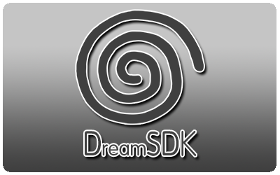

# Welcome to DreamSDK!

**DreamSDK is a modern, ready-to-use environment for the Sega Dreamcast
development, designed for the Microsoft Windows platform**.

By installing DreamSDK you can start developing for your Sega Dreamcast today,
on Windows OS, without bothering with toolchains, libraries or configuration. 
DreamSDK is used for producing Sega Dreamcast homebrews/games, even commercial
ones, like [The Textorcist](https://gamefairy.io/product/textorcist-dreamcast-limited-to-666/)
or [Shadow Gangs](https://www.kickstarter.com/projects/jkmcorp/shadow-gangs-dreamcast-version)!

DreamSDK is a full package composed by a lot of free/open-source softwares,
mainly [KallistiOS](http://gamedev.allusion.net/softprj/kos/) (the library used
for interacting with the Sega Dreamcast hardware), the 
[GNU toolchain](https://en.wikipedia.org/wiki/GNU_toolchain), and some special
programs made for this package
(e.g., [DreamSDK Manager](https://github.com/dreamsdk/manager)).

## About GNU/Linux, macOS and WSL

If you are using **GNU/Linux** or **macOS**, DreamSDK is totally useless for you. 
As all required Sega Dreamcast components are based on GNU/Linux components, 
setuping a working environment for developing on Sega Dreamcast on is easy. You
just have to follow the official steps described in the [KallistiOS 
documentation](http://gamedev.allusion.net/softprj/kos/setup.php). That's why 
DreamSDK won't support GNU/Linux or macOS because it isn't necessary.

If you are using [Windows Subsystem for Linux (WSL)](https://en.wikipedia.org/
wiki/Windows_Subsystem_for_Linux) on Windows 10+, you can avoid using DreamSDK
as you have a native Unix-like shell directly on your computer. However, using
DreamSDK will facilitate the environment setup as all the toolchains and
required components are already compiled/ready to be used. Indeed, compiling the
required toolchains can take several hours to complete (using the `dc-chain`
utility provided in the `utils/dc-chain` directory from the KallistiOS
repository).

## Introduction

This repository contains everything you need to produce **DreamSDK**
installation packages. Using this repository you'll be able to generate the 3
installation packages ... :

* The ISO image - `DreamSDK-R<release_number>-Setup.iso`;
* The Padus DiscJuggler image (CDI) containing
  [dcload-ip](https://gitlab.com/kallistios/dcload-ip): 
  `DreamSDK-R<release_number>-dcload-ip-<dcload_version>.cdi`;
* The Padus DiscJuggler image (CDI) containing
  [dcload-serial](https://gitlab.com/kallistios/dcload-serial):
  `DreamSDK-R<release_number>-dcload-serial-<dcload_version>.cdi`.

... where `release_number` is the version of the DreamSDK you want to generate
(this is detailed in the `setup-generator` repository). ISO image hold the
full installer of DreamSDK for the computer while 
[Padus DiscJuggler images](https://en.wikipedia.org/wiki/DiscJuggler) (CDI) are
[bootable discs](https://en.wikipedia.org/wiki/MIL-CD) for your Sega Dreamcast, 
containing DreamSDK and the **dcload** program used for running your programs
and remote debugging.

To produce these 3 installation packages, you will need to install the
prerequisites and execute the 4 scripts described below, in the specified order.

## Prerequisites

First of all, you will need to install:

* [DreamSDK](https://dreamsdk.org) - Yes, you will need a previous version of
  DreamSDK to produce a new one.
* [Lazarus IDE](https://www.lazarus-ide.org/) - DreamSDK components are written
  in [Free Pascal](https://www.freepascal.org/). 
* [Python 3.x](https://www.python.org/) - Some scripts used in the production
  process are written in Python.
* [Git](https://git-scm.com/) - Used for retriving some components from Git
  repositories.
* [UPX](https://upx.github.io/) - DreamSDK binaries are packed with UPX, **using
  the 32-bit version**.
* 7-Zip
* ...

## Installing the prerequisites

### Installing the previous DreamSDK package

You may install the previous version of DreamSDK in the default directory.
Please note that only one version of DreamSDK can be installed on the computer
at this time (mainly, due to the usage of the `DREAMSDK_HOME` environment
variable), so if you want to test your generated package, it will uninstall the
previous one. Then you can use your installed package for regenerating another
one, as only a few utilities embedded in DreamSDK are used for producing the
package (e.g., `patch`...).

### Installing Lazarus IDE

Lazarus is a key component as every DreamSDK binaries are written in Free
Pascal. You may install the Lazarus IDE itself in 64-bit but all DreamSDK
binaries should be generated in 32-bit only, as DreamSDK is a package full of
32-bit binaries supporting Windows XP.

To install Lazarus IDE:

## Building DreamSDK

For building DreamSDK, you need to configure then execute the 4 scripts
described below. You need to execute them in that order as they are dependencies
check between all of them.

### Step 1: Offline

The first script to execute is called `offline`.

Starting with **DreamSDK R3**, you have the possibility to use DreamSDK in an
offline mode only, that's why we need to embedded the components directly in the
Setup package. Of course the online mode is better and we encourage the user to
do so but sometime, you don't have the choice to be offline. The user can choose
the offline package directly when installing DreamSDK or later on through
DreamSDK Manager.

This script is preparing everything for embedding **KallistiOS**, **KOS Ports**,
**Dreamcast Tool** and **Ruby** libraries directly the DreamSDK Setup package.

### Step 2: Prepare

The `prepare` script is very important as it gather all the components used to
produces DreamSDK. This script is generating the `.sources` directory that will
be embedded in the **DreamSDK Setup** package.

...

### Step 3: MkSetup

The `mksetup` script will generate the **DreamSDK Setup** package itself.
Starting from that point, DreamSDK is ready to be used but not really
distributed officially, this is the purpose of the next step.

### Step 4: MkImage

This is the last script to use: `mkimage`. This will produce the official images
containing DreamSDK for distribution.

## About the Code::Blocks IDE integration

For building Code::Blocks you will need some more tools

...

